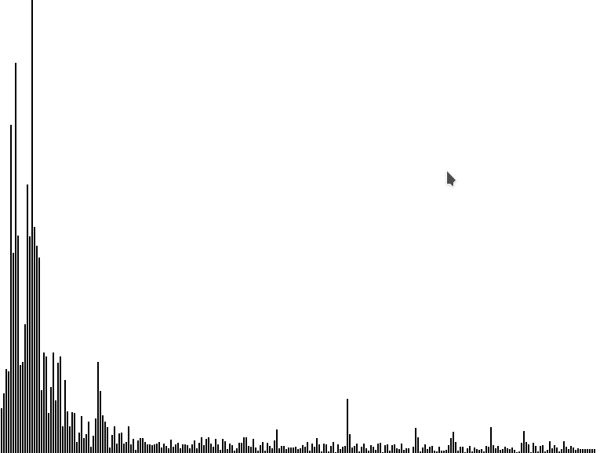
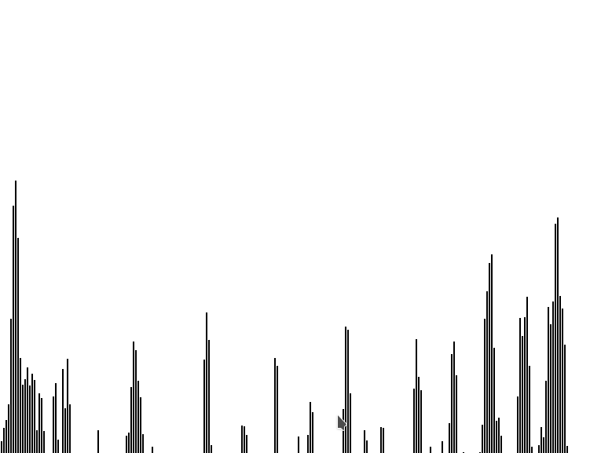

()<!-- Articles docentes sobre OpenAL -->
<h1>OpenAL examples</h1>
This repository must be considered a contribution to the community of OpenAL developers and my own way to get back the lessons that I have been learning from others.

"OpenAL examples" is a repository of examples of C source code that uses OpenAL in several ways:
<ul>
 <li>You can find approaches to using other audio formats than WAVE files as input audio to OpenAL.</li>
 <li>You can find an explanation of OpenAL concepts like static vs streaming techniques for playing audio files.</li>
 <li>Also, you can get basic visualizations related to audio waveform: I enjoy painting the audio waveform and the frequency spectrum to help visualize the relationship between the digital audio samples in time and frequency domains and the sound you can hear.</li> 
</ul>

The code has documentation (in Spanish) that remarks on the sources used to build the examples or from where I obtained them. The idea behind each use case and a little explanation of the code. Also, you can find a way to compile these examples from a Linux terminal. 

I tried to explicitly put the references from where I got the inspiration or the exact example that I reproduced, but if you miss one reference, please do not hesitate to send me an email.

List of OpenAL related articles:
<ul>
 <li> (2011). Introducción al procesado de audio mediante OpenAL. &lt;http://hdl.handle.net/10251/12694 &gt;. Keywords: Procesado de audio, Openal.
 </li>

 <li> (2011). Efectos de audio básicos mediante OpenAL. &lt;http://hdl.handle.net/10251/12696&gt;. Keywords:
Procesado de audio, Openal.
 </li>

 <li> (2011). Introducción al empleo de técnicas de audio posicional mediante OpenAL. &lt;http://hdl.handle.net/10251/12697 &gt;. Keywords:
Audio posicional, Audio envolvente, Audio espacial, Audio 3d, Procesado de audio, Openal.</li>

 
 <li> OpenAL_microphone: (2012). Uso del micrófono para captura de audio en OpenAL. &lt;http://hdl.handle.net/10251/17547 &gt;. Keywords:
 Captura de audio, Adquisición de audio, Micrófono, Openal.
 </li>

 
 <li> OpenAL_Vorbis: (2018). Extendiendo OpenAL con OGG Vorbis. &lt;http://hdl.handle.net/10251/109210 &gt;. Keywords:
 Ogg Vorbis, OpenAL, importar Vorbis, PCM, audio comprimido.
 </li>

 <li> OpenAL_SDL_MP3: (2018). Extendiendo OpenAL con SDL. Caso de estudio MP3. &lt;http://hdl.handle.net/10251/105383 &gt;. Keywords:
OpenAL, SDL, MP3.
 </li>

 <li> OpenAL_extensionesAmbientales: (2018). Extensiones para OpenAL: efectos ambientales. &lt;http://hdl.handle.net/10251/105664 &gt;. Keywords:
 OpenAL, Extensions, EFX, simulación del entorno, efectos ambientales, Reverberación, Reverb.
 </li>

 <li> (2018). OpenAL y OpenGL: escuchar y ver el sonido. &lt;http://hdl.handle.net/10251/105550 &gt;. Keywords:
 Forma de ondas, pintar el sonido, PCM, OpenAL, OpenGL.
 </li>

 <li> (2018). OpenAL: efecto Doppler. Posicionamiento y velocidad del sonido. &lt;http://hdl.handle.net/10251/104052 &gt;. Keywords:
Efecto Doppler., OpenAL, posicionamiento 3D audio, velocidad del sonido.
 </li>

 <li> OpenAL_Opus: (2018). Reproducción de ficheros Opus con OpenAL: precarga vs "streaming". &lt;http://hdl.handle.net/10251/109211 &gt;. Keywords:
 Opus, OpenAL, importar Opus, PCM, audio comprimido, precarga, streaming.
 </li>

 
  <li> OpenAL_MP3_libmad: (2021). Extendiendo OpenAL con ficheros MP3 y libMAD. &lt;http://hdl.handle.net/10251/170185  &gt;. Keywords:
Formatos de audio, Formatos MP3, Librería libmad, MP3, OpenAL, Importar clip de audio en MP3.
  </li>

  <li> OpenAL_FLAC : (2021). Reproducción de ficheros FLAC con OpenAL y dr_flac. &lt;http://hdl.handle.net/10251/170187 &gt;. Keywords:
Free Lossless Audio Codec (FLAC), Ficheros FLAC, FLAC, OpenAL, Importar clip de audio en FLAC, Dr_flac.
  </li>

  <li> (2021). Reproducción de ficheros MIDI con OpenAL. &lt;http://hdl.handle.net/10251/170183 &gt;. Keywords:
 Formatos audio , formato MIDI , Musical Instrument Digital Interface (MIDI) , WildMIDI library , MIDI , OpenAL , Importar MIDI.
  </li>

 <li>OpenAL_MIDI_libWildMIDI: (2021). Reproducción de ficheros MIDI con OpenAL. &lt;http://hdl.handle.net/10251/170183 &gt;. Keywords:
  Formatos audio, formato MIDI, Musical Instrument Digital Interface (MIDI), WildMIDI library, MIDI, OpenAL, Importar MIDI. 
  </li>
  
 <!-- 2k21/2k22 -->
 <li> OpenAL_ALUT_vs_ALC_AL: (2022). Arquitectura de niveles en OpenAL: AL, ALC y ALUT. &lt;http://hdl.handle.net/10251/184326 &gt;. Keywords:  ALC API, Audio API, OpenAL Utility Toolkit (ALUT), Open Audio Library, ALUT, OpenAL, Operaciones de ALUT, OpenAL sin ALUT, Audio Layer (AL). </li>
 
 <li> OpenAL_libsndfile_streaming: (2022). OpenAL: usando libsndfile para reproducción en streaming de ficheros de audio. Universitat Politècnica de València. &lt;http://hdl.handle.net/10251/183656 &gt;. Keywords:  Libsndfile, OpenAL, Streaming, Reproducir audio en continuo.</li>
 
 <li> OpenAL_libsndfile_preload: (2022). OpenAL: comparativa de ALUT y libsndfile para reproducción en precarga de ficheros de audio. &lt;http://hdl.handle.net/10251/183788 &gt;. Keywords: Códecs de audio, Waveform Audio Format (WAV), Free Lossless Audio Codec (FLAC), Ficheros de audio, OpenAL Utility Toolkit (ALUT), Libsndfile, OpenAL, WAVE, FLAC.</li>
 
 <li> OpenAL_MP3_libmpg123: (2022). Extendiendo OpenAL con ficheros MP3 y libmpg123. &lt;http://hdl.handle.net/10251/183758 &gt;. Keywords: mpg123, MP3, libmpg123, OpenAL.</li>
 
 <li> OpenAL_ALURE_HwAudio: (2022). ALURE: interfaz de alto nivel para OpenAL. Servicios relacionados con el hardware de audio. &lt;http://hdl.handle.net/10251/184329 &gt;. Keywords:  mpg123, MP3, libmpg123, OpenAL.</li>
 
 <li> 
OpenAL_ALURE_ficherosDeAudio: (2022). ALURE: interfaz de alto nivel para OpenAL. Servicios relacionados con la reproducción de ficheros de audio. &lt;http://hdl.handle.net/10251/184940 &gt;. Keywords: ALURE, ALUT, OpenAL, Reproducción de ficheros de audio, Cargar audio desde fichero.</li>
 
 <!-- <li> nomDelSubdirectori: Referència a riunet &lt; URL &gt;. Keywords: paraules clau.</li> -->
 
 
 
 <li> OpenAL_libsndfile_preload: (2022) OpenAL: comparativa de ALUT y libsndfile para reproducción en precarga de ficheros de audio. http://hdl.handle.net/10251/183788. Keywords: Códecs de audio, Waveform Audio Format (WAV), Free Lossless Audio Codec (FLAC), Ficheros de audio, OpenAL Utility Toolkit (ALUT), Libsndfile, OpenAL, WAVE, FLAC. </li>
 <li> OpenAL_libsndfile_streaming: (2022). OpenAL: usando libsndfile para reproducción en streaming de ficheros de audio. Universitat Politècnica de València. http://hdl.handle.net/10251/183656. Keywords: Keyword: ibsndfile, OpenAL, Streaming, Reproducir audio en continuo.</li>
 
 
 <li> OpenAL_Python/OpenAL_Python_basicSignals/: (2023) OpenAL con Python: generación de señales básicas. Keywords: OpenAL, ALUT, Python, generación de señales básicas, whitenoise, ruido blanco, senoidal.</li>
 

 <li>OpenAL_FFT_2D: (2025/2026)[Introducción al cálculo y visualización del espectro de frecuencias embebido en OpenAL](https://github.com/magusti/OpenaAL_examples/OpenAL_FFT_2D) . 
 
## Introducción al cálculo y visualización del espectro de frecuencias embebido en OpenAL

Screenshot of OpenAL and SDL drawing FFT computed by lifftw.

Keywords:
 Espectro de frecuencias, pintar el sonido, FFT, OpenAL, SDL.
<!-- Commented in ... -->
 In process...
 </li>
 
 <li>OpenALSoft_alLoopBack: (2025/2026) [Grabar la salida de audio 3D de OpenAL / OpenAL Soft a fichero](https://github.com/magusti/OpenaAL_examples/OpenALSoft_alLoopBack: . 
## Grabar la salida de audio 3D a fichero: OpenALSoft LoopBack

Screenshots: 

<!--
 References:
  <ul>
   <li>
   </li>
   </ul>
-->
<!-- Commented in ... -->
In process...
</li>

<li>[Visualización de la onda de sonido y del espectro de frecuencias ](https://github.com/magusti/OpenaAL_examples/OpenAL_drawing_WAVE_FFT: (2026/2027?). 
## Ejemplos de visualización de audio 2D y 3D usando OpenAL y SDL/OpenCV

Screenshot 

 References:
  <ul>
   <li>OpenAL y OpenGL: escuchar y ver el sonido. http://hdl.handle.net/10251/105550.
   </li>
   <li>Introducción al cálculo y visualización del espectro de frecuencias embebido en OpenAL. https://github.com/magusti/OpenaAL_examples/OpenAL_FFT_2D.
   </li>
   </ul>

<!-- Commented in ... -->
In process...
</li>

</ul>

 

<!-- Agraiments --> 
<h1>Thanks to</h1>

 Loki Soft for create and distribute OpenAL for free. I hope it will become as free as it deserves. And also by the ["OpenAL Specification and Reference"](https://www.openal.org/documentation/).

 The community of persons that maintain the OpenAL website  <http://www.openal.org>, the "openal mailing list" <https://openal.org/mailman/listinfo/openal>  and especially to Chris Robinson by his OpenAL Soft <https://openal-soft.org/> that makes possible that everyone can use this standard.

 Garin Hiebert, Garin Hiebert, Peter Harrison and Daniel Peacock for the OpenAL documentation:  "OpenAL Programmer's Guide" &lt;https://www.openal.org/documentation/ &gt;.

 Steve Baker and Sven Panne <http://distro.ibiblio.org/rootlinux/rootlinux-ports/more/freealut/freealut-1.1.0/doc/alut.html#alutGetMIMETypes> for the "OpenAL Utility Toolkit (ALUT) Reference Manual".

 vancegroup <https://github.com/vancegroup/freealut/> for implementing "freealut" <http://distro.ibiblio.org/rootlinux/rootlinux-ports/more/freealut/freealut-1.1.0/doc/alut.html>.

 Daniel Peacock, Peter Harrison, Andrea D’Orta, Valery Carpentier and Edward Cooper for the "Effects Extension Guide" <https://usermanual.wiki/Pdf/Effects20Extension20Guide.90272296/html>.

 Ryan A. Pavlik <https://github.com/rpavlik/openal-svn-mirror>  for publish the original fork of OpenAL.

 
 Thanks to the community of persons that maintain the OpenAL website  <http://www.openal.org>, the "openal mailing list" &lt;https://openal.org/mailman/listinfo/openal&gt;, and to everybody that ask and answer in the "openal mailing list".

 And especially to Chris Robinson by his OpenAL Soft &lt;https://openal-soft.org/&gt; / &lt;https://github.com/kcat/openal-soft&gt; that makes possible that everyone can use this standard and for publish it under a LGPL license. Also for ALURE &lt;https://github.com/kcat/alure&gt;, and also for his expert and kind words in emails.

M. Agustí (2010-2026). magusti at disca.upv.es
